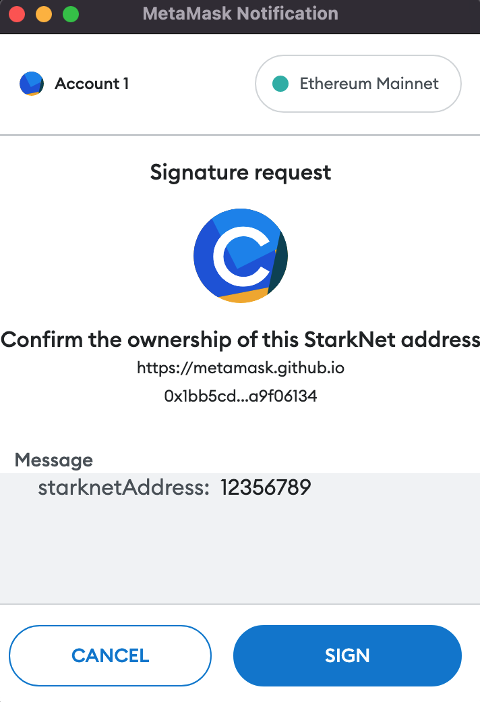

# EIP712 authentication in cairo 
In this article, I would like to show you how to verify messages signed as described in EIP712 on StarkNet. This requires recreating the original EIP712 payload, hashing it, and verifying Ethereum signature.
## Background
Make sure that you're familiar with [cairo-lang](https://www.cairo-lang.org) as it is essential in this case.
There is a whole dedicated [piece](https://blog.swmansion.com/testing-starknet-contracts-made-easy-with-protostar-2ecdad3c9133) explaining almost everything you would need to know before reading this article, so make sure to check it out. Also, some knowledge about [EIP-712](https://eips.ethereum.org/EIPS/eip-712) would be nice too, as I won't be going into details about how it works.

# Use case - creating a binding between ETH address and Starknet Address

## Message structure
```json
{
  "domain": {
    "name": "Confirm the ownership of this StarkNet address",
    "contractAddress": "0xFFFFFFFFFFFFFFFFFFFFFFFFFFFFFFFFFFFFFFFF",
    "version": "1"
  },

  "primaryType": "Payload",
  "types": {
    "domain": [
      { "name": "name", "type": "string" },
      { "name": "contractAddress", "type": "address"},
      { "name": "version", "type": "string" }
    ],
    "Payload": [
      { "name": "starknetAddress", "type": "uint256" }
    ]
  }
}
```
This is the structure that we'll be using in this example. Note that `domain` here represents `eip712Domain` which, after hashing, will become a domain separator that we will need.<br/>
Elements of the domain are as follows:
* `name` - the user readable name of signing domain, i.e. the name of the DApp or the protocol.
* `version` - the current major version of the signing domain. Signatures from different versions are not compatible.
* `contractAddress` - the address of the contract that will verify the signature. It ensures that the signature can only be used by our contract on the given chain.

`Payload` will be the main structure that we'll be constructing and signing. For the sake of simplicity, it only has one field but the EIP-712 standard offers a lot of flexibility.


## Signing with an Ethereum wallet
Let's use Metamask as an example. You just need to call the `signTypedData_v4` function (inputting the correct address in the `starknetAddress` field) and it will return the signature that we need.<br/>
```js
const msg = {
  domain: {
    name: "Confirm the ownership of this StarkNet address",
    verifyingContract: '0xFFFFFFFFFFFFFFFFFFFFFFFFFFFFFFFFFFFFFFFF',
    version: '1',
  },
  message: {
    "starknetAddress": 12356789,
  },
  primaryType: 'Payload',
  types: {
    domain: [
      { name: 'name', type: 'string' },
      { name: 'verifyingContract', type: 'address' },
      { name: 'version', type: 'string' },
    ],
    Payload: [
      { name: 'starknetAddress', type: 'uint256' },
    ],
  },
};
const accounts = await window.ethereum.request({method: "eth_requestAccounts"})
await window.ethereum.request({
    method: "eth_signTypedData_v4",
    from: accounts[0],
    params: [accounts[0], JSON.stringify(msg)]
})
```
After you run this this JS code in the browser's console on the MetaMask website it will trigger a signing request. An application would use a similar code to get user's accounts and signature. <br/><br/>
<br/><br/>
As you can see everything is transparent so you don't have to sign something blindly - that's one of the pros of using EIP-712 standard.<br/><br/>
<br/>
When you sign this message you will receive the message signature that we need. After that we can send a transaction containing both the Ethereum address and the signature to StarkNet's contract.
## Creating a connection
Before we create a connection we need to ensure that the caller owns both the addresses. This is how we can do it:
1. Sign the structure containing the StarkNet address with our Ethereum account
2. Call the contract that we are creating with received signature and our Ethereum address from your StarkNet account.
3. By calling `get_caller_address()` and using it as our Starknet address we ensure that it indeed belongs to the user and we will use it when reconstructing a signed message.
4. Recreate the message structure and hash it with keccak256.
5. Extract Ethereum address from Ethereum signature and the hash from previous step.
6. Compare Ethereum address received as an input to the address extracted from the step before.

The hardest part for us is getting the hash of our message. Once we have that, we can use a built-in function `verify_eth_signature_uint256` that combines steps 5 and 6 and will do all the heavy lifting, dealing with complicated math. 
So we will have to write a function that constructs an eip712 structure and returns its hash.

## Recreating and hashing the message
### The basic idea
Since the ownership of the Ethereum account is confirmed by signing the message for which the private key is needed, we also need to confirm that the user owns the StarkNet account that is supposed to be connected. That's why we're deliberately not passing `starknet_address` as an input variable, instead, we call `get_caller_address()`, which we'll use as the address we need. The connection will be created only if the address of the account executing the tx is the one signed.
### Constants
Instead of calculating the structure hash every time, we can precalculate it and store it as a constant to save us some computationally expensive operations. Additionally, Ethereum uses a pre-chosen prefix, which is explained in the [documentation](https://eips.ethereum.org/EIPS/eip-712)

```cairo
const PREFIX = 0x1901;

// A Hash of a structure that we're signing (Payload) which is shown in struct.json file
const TYPE_HASH_HIGH = 0xd3edf21d0254954db14d94abab56644c;
const TYPE_HASH_LOW = 0x1100d60cff7b050ffcb29574618d516e;
```
Because we are using keccak256 for hashing, we need to store the result in two pieces (lower and higher 128 bits) as felts store only up to 251 bits. <br/><br/>
We could do the same with the domain separator, but there is one small obstacle - we'll be using this contact's address as a variable in the domain, and hardcoding this value would affect resulting hash, changing the value itself. So how can we deal with it? We certainly don't need to calculate it every time the function is called; we can just create a storage variable that can only be set once and put our precalculated domain separator there after contract deployment.

 ```cairo
 %lang starknet

from starkware.cairo.common.alloc import alloc
from starkware.cairo.common.uint256 import Uint256, uint256_eq
from starkware.cairo.common.cairo_builtins import HashBuiltin

@storage_var
func domain_sep() -> (domain_separator: Uint256) {
}

func get_domain_separator{syscall_ptr : felt*, pedersen_ptr : HashBuiltin*, range_check_ptr}()->(domain_separator: Uint256){
    alloc_locals;
    let (domain_separator: Uint256) = domain_sep.read();
    let (check) = uint256_eq(domain_separator, Uint256(0,0));
    // If domain separator is 0 then it hasn't been set yet and we shouldn't use it yet.
    with_attr error_message(
        "Domain separator hash must be set before use."
    ){
        assert check = 0;
    }
    return (domain_separator = domain_separator);
}

@external
func set_domain_separator{syscall_ptr : felt*, pedersen_ptr : HashBuiltin*, range_check_ptr}(domain_separator: Uint256){
    alloc_locals;
    let (domain_separator_check) = domain_sep.read();
    let (check) = uint256_eq(domain_separator_check, Uint256(0,0));
    // It domain separator is anything but 0 then it has already been set and it should remain unchangable
    with_attr error_message(
        "Domain separator hash can only be set once."
    ){
        assert check = 1;
    }
    domain_sep.write(domain_separator);
    return();
}
 ```
An account deploying mapping contract should perform set_domain_separator within the same transaction as deployment, using multicall.
### Recreating the message hash
Since our example is pretty easy, our structure contains only one field (starknetAddress), recreating the hashable string is pretty easy; we just need to concatenate the structure hash with our value.


 ```cairo
 func get_eip712_hash{range_check_ptr,  keccak_ptr: felt*, bitwise_ptr : BitwiseBuiltin*}(starknet_address: felt,
 domain_hash : Uint256) -> (hashed_msg : Uint256)
{
    let (starknet_address_h, starknet_address_l) = split_felt(starknet_address);
    
    let (encoded_data : Uint256*) = alloc();
    assert encoded_data[0] = Uint256(TYPE_HASH_LOW, TYPE_HASH_HIGH);
    assert encoded_data[1] = Uint256(starknet_address_l, starknet_address_h);
    let (data_hash) = keccak_uint256s_bigend{keccak_ptr=keccak_ptr}(2, encoded_data);
 ```
Because `keccak_uint256s_bigend` takes an array of Uint256 structures as an argument, we need to convert our input to this format. <br/><br/>
The last remaining thing is to combine domain hash and message hash and apply keccak256 to it. There is a small problem — the 2 byte prefix, which prevents us keccak_uint256s_bigend, we need to add the prefix first.
```cairo
// value has to be a 16 byte word
// prefix length = PREFIX_BITS
func add_prefix{range_check_ptr, bitwise_ptr : BitwiseBuiltin*}(value : felt, prefix : felt) -> (
        result : felt, overflow: felt){
    let shifted_prefix = prefix * 2 ** 128;
    // with_prefix is 18 bytes long
    let with_prefix = shifted_prefix + value;
    let overflow_mask = 2 ** 16 - 1;
    let (overflow) = bitwise_and(with_prefix, overflow_mask);
    let result = (with_prefix - overflow) / 2 ** 16;
    return (result, overflow);
}
```
We're again operating on 128 bit values, so we need to shift everything to fit our prefix.

```cairo
    let prefix = PREFIX;
    let (w0, prefix) = add_prefix(domain_hash.high, prefix);
    let (w1, prefix) = add_prefix(domain_hash.low, prefix);
    let (w2, prefix) = add_prefix(data_hash.high, prefix);
    let (w3, overflow) = add_prefix(data_hash.low, prefix);
```

We can't use the same high-level keccak implementation as before (`keccak_uint256s_bigend`), since it assumes that our input in bytes is a multiple of 32, which it is not. Because of the 2 overflow bytes, our input is 66 bytes long, and thus `keccak_uint256s_bigend` will assume that we're also counting all the leading zeros of the last value, making our input 96 bytes long, which would result in incorrect hashes. The solution is to use the low-level keccak function - `keccak_bigend`, which unfortunately takes the input in the little-endian format, forcing us to change our variables to it. Note that the `bigend` in the name of the function refers to the output format, not the input format.

```cairo
// Splits 128bit big endian int to 2 64bit small endian ints
func split_to_64bit_small_endian_words{range_check_ptr, bitwise_ptr : BitwiseBuiltin*}(value: felt) -> (high: felt, low: felt){
    let (temp) = word_reverse_endian(value);
    let (high, low) = unsigned_div_rem(temp, DIVISOR);
    return (high, low);
}
// Changes input format to array of 64bit values in little endian format
func populate_array_little_end{range_check_ptr, bitwise_ptr : BitwiseBuiltin*}(w0: felt, w1: felt, w2: felt, w3: felt, overflow: felt, signable_bytes : felt*){
    
    let (high, low) = split_to_64bit_small_endian_words(w0);
    assert signable_bytes[0] = low;
    assert signable_bytes[1] = high;

    let (high, low) = split_to_64bit_small_endian_words(w1);
    assert signable_bytes[2] = low;
    assert signable_bytes[3] = high;

    let (high, low) = split_to_64bit_small_endian_words(w2);
    assert signable_bytes[4] = low;
    assert signable_bytes[5] = high;

    let (high, low) = split_to_64bit_small_endian_words(w3);
    assert signable_bytes[6] = low;
    assert signable_bytes[7] = high;

    // Overflow is only 2 bytes long
    let (temp) = word_reverse_endian(overflow);
    let (value8, trash) = unsigned_div_rem(temp, 2**112);
    assert signable_bytes[8] = value8;

    return ();
}
```
Now we can finish our `get_eip712_hash` function.
```cario
func get_eip712_hash{range_check_ptr,  keccak_ptr: felt*, bitwise_ptr : BitwiseBuiltin*}(starknet_address: felt, domain_hash : Uint256) -> (
        hashed_msg : Uint256){

    let (starknet_address_h, starknet_address_l) = split_felt(starknet_address);
    
    let (encoded_data : Uint256*) = alloc();
    assert encoded_data[0] = Uint256(TYPE_HASH_LOW, TYPE_HASH_HIGH);
    assert encoded_data[1] = Uint256(starknet_address_l, starknet_address_h);
    let (data_hash) = keccak_uint256s_bigend{keccak_ptr=keccak_ptr}(2, encoded_data);

    let prefix = PREFIX;
    let (w0, prefix) = add_prefix(domain_hash.high, prefix);
    let (w1, prefix) = add_prefix(domain_hash.low, prefix);
    let (w2, prefix) = add_prefix(data_hash.high, prefix);
    let (w3, overflow) = add_prefix(data_hash.low, prefix);
    
    let (signable_bytes : felt*) = alloc();
    
    // w0, w1, w2, w3, and overflow need to be split into 64 bit chunks in little endian format
    populate_array_little_end(w0, w1, w2, w3, overflow, signable_bytes);

    // final value is 66 bytes long 
    let (res) = keccak_bigend{keccak_ptr=keccak_ptr}(signable_bytes, 66);
    
    return (hashed_msg = res);  
}
```
After getting the message hash from the `get_eip712_hash` function and splitting our signature into v, r, and s parts, all that's left to do is call `verify_eth_signature_uint256`.
```cairo
func assert_valid_eth_signature{
        syscall_ptr : felt*, pedersen_ptr : HashBuiltin*, range_check_ptr,
        bitwise_ptr : BitwiseBuiltin*
}(eth_address: felt, starknet_address: felt, domain_hash: Uint256, signature_len: felt, signature: felt*){
    alloc_locals;
    with_attr error_message(
        "Invalid signature length. Signature should have exactly 5 elements."
    ){
        assert signature_len = 5;
    }

    let v = signature[0];
    let r = Uint256(signature[2], signature[1]);
    let s = Uint256(signature[4], signature[3]);
    
    let (local keccak_ptr_start) = alloc();
    let keccak_ptr = keccak_ptr_start;

    let (hash_uint) = get_eip712_hash{keccak_ptr=keccak_ptr}(starknet_address, domain_hash);
   
    verify_eth_signature_uint256{keccak_ptr=keccak_ptr}(hash_uint, r, s, v, eth_address);

    finalize_keccak(keccak_ptr_start=keccak_ptr_start, keccak_ptr_end=keccak_ptr);

    return ();
}
```
It's **VERY** important that we call `finalize_keccak` because of the internal batching done inside it. Failing to call it will make the keccak function unsound - the prover will be able to choose any value as the keccak's result.

## Finalizing
If everything matches, no assertion fails and `save_connected_addresses` function will be called, which will bind our two addresses together.
```cairo
@external
func add_connection{
    syscall_ptr : felt*,
    pedersen_ptr : HashBuiltin*,
    range_check_ptr,
    bitwise_ptr : BitwiseBuiltin*
}(eth_address : felt, starknet_address : felt, domain_hash: Uint256, signature_len: felt, signature: felt*){
    assert_valid_eth_signature(eth_address, starknet_address, domain_hash, signature_len, signature);
    save_connected_addresses(eth_address, starknet_address);
    return ();
}
```
The last thing to do is actually create a connection between `eth_address` and `starknet_address`. As this is an example, we'll be using a basic map between a pair of addresses and a boolean value (`read` function of a storage variable in cairo will return 0 if a key doesn't exist). In our, simple, case `save_connected_addresses` just calls an internal `write` function of the storage variable.<br/>

```cairo
%lang starknet

from starkware.cairo.common.cairo_builtins import HashBuiltin
from starkware.cairo.common.math import assert_nn


@storage_var
func storage(eth_address : felt, starknet_address : felt) -> (exists: felt){
}
```
Bear in mind that we won't be able to list all the Starknet addresses connected to the Ethereum address or vice versa. All we can do is check whether some two addresses are connected or not. If you want some more advanced functions, you'd need to change how the addresses are bound - for example, instead of <br/>`func storage(eth_address : felt, starknet_address : felt) -> (exists: felt)`
as a storage variable, you could use <br/>
`func storage(eth_address : felt, starknet_address_index : felt) -> (starknet_address: felt)` which, instead of mapping a pair of `eth_address` and `starknet_address` to a 1, marking the existence of the connection, maps the pair of `eth_address` and index to the `starknet_address` allowing you to iterate through them:
```
storage(0x1, 0) = 0x321312
storage(0x1, 1) = 0x721397
storage(0x1, 2) = 0 (not set, there are 2 bindings for address 0x1)
````


